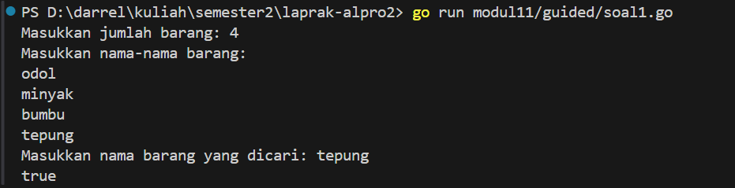
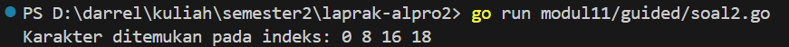
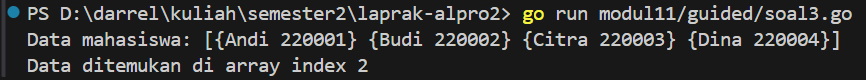
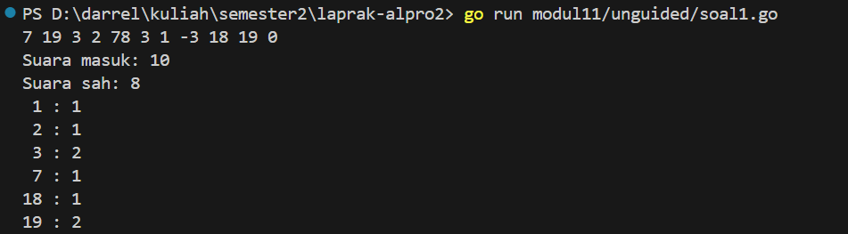
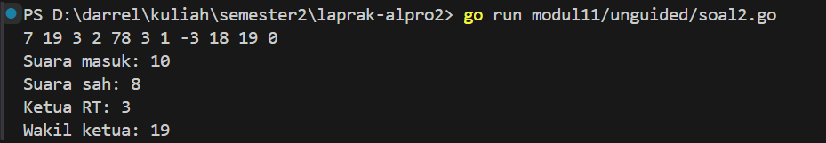
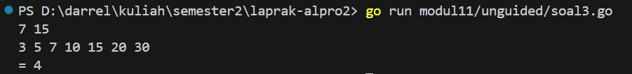

<h1 align="center">Laporan Praktikum Modul 11 <br>  PENCARIAN NILAI ACAK PADA HIMPUNAN DATA</h1> 

___
<h4 align="center">Gien Darrel Adli - 103112430008 </h4>

# Guided
### Soal-1. 
```go
package main

import "fmt"

func cariBarang(daftar []string, x string) bool {
	for _, barang := range daftar {
		if barang == x {
			return true
		}
	}
	return false
}

func main() {
	var n int
	fmt.Print("Masukkan jumlah barang: ")
	fmt.Scan(&n)

	daftarBarang := make([]string, n)
	fmt.Println("Masukkan nama-nama barang:")
	for i := 0; i < n; i++ {
		fmt.Scan(&daftarBarang[i])
	}

	var barangDicari string
	fmt.Print("Masukkan nama barang yang dicari: ")
	fmt.Scan(&barangDicari)

	ditemukan := cariBarang(daftarBarang, barangDicari)
	fmt.Println(ditemukan)
}

```


>Program ini digunakan untuk mencari apakah suatu barang ada dalam daftar barang yang sudah dimasukkan. Pertama, program meminta pengguna untuk memasukkan jumlah barang dan kemudian nama-nama barang tersebut. Setelah itu, program meminta pengguna untuk memasukkan nama barang yang ingin dicari. Fungsi cariBarang digunakan untuk mencari barang tersebut dalam daftar dengan cara iterasi. Jika barang ditemukan, fungsi akan mengembalikan nilai true, jika tidak ditemukan akan mengembalikan nilai false. Hasil pencarian kemudian ditampilkan, apakah barang ditemukan atau tidak.


### Soal-2. 
```go
package main

import "fmt"

func cariBarang(daftar []string, x string) bool {
	for _, barang := range daftar {
		if barang == x {
			return true
		}
	}
	return false
}

func main() {
	var n int
	fmt.Print("Masukkan jumlah barang: ")
	fmt.Scan(&n)

	daftarBarang := make([]string, n)
	fmt.Println("Masukkan nama-nama barang:")
	for i := 0; i < n; i++ {
		fmt.Scan(&daftarBarang[i])
	}

	var barangDicari string
	fmt.Print("Masukkan nama barang yang dicari: ")
	fmt.Scan(&barangDicari)

	ditemukan := cariBarang(daftarBarang, barangDicari)
	fmt.Println(ditemukan)
}

```


>Program ini mencari indeks kemunculan suatu karakter dalam sebuah kalimat. Dalam program ini, kalimat yang dicari adalah "algoritma pemograman" dan karakter yang dicari adalah 'a'. Program melakukan iterasi melalui setiap karakter dalam kalimat, dan setiap kali menemukan karakter yang cocok, indeksnya disimpan dalam slice cari. Setelah proses pencarian selesai, program akan mencetak semua indeks di mana karakter 'a' ditemukan. Jika karakter tidak ditemukan, program akan menampilkan pesan "Karakter tidak ditemukan."

### Soal-3. 
```go
package main

import "fmt"

type Mahasiswa struct {
	nama string
	nim  string
}

func binarySearch(mahasiswa []Mahasiswa, nimCari string) int {
	kecil := 0
	besar := len(mahasiswa) - 1

	for kecil <= besar {
		mid := (kecil + besar) / 2

		if mahasiswa[mid].nim == nimCari {
			return mid
		} else if mahasiswa[mid].nim < nimCari {
			kecil = mid + 1
		} else {
			besar = mid - 1
		}
	}
	return -1
}

func main() {
	var X string

	mahasiswa := []Mahasiswa{
		{nama: "Andi", nim: "220001"},
		{nama: "Budi", nim: "220002"},
		{nama: "Citra", nim: "220003"},
		{nama: "Dina", nim: "220004"},
	}

	X = "220003"

	fmt.Println("Data mahasiswa:", mahasiswa)

	index := binarySearch(mahasiswa, X)

	if index != -1 {
		fmt.Printf("Data ditemukan di array index %d\n", index)
	} else {
		fmt.Println("Mahasiswa dengan NIM tersebut tidak ditemukan.")
	}
}


```


>Program ini mencari data mahasiswa berdasarkan NIM menggunakan binary search. Data mahasiswa disimpan dalam array, dan pencarian dilakukan untuk menemukan NIM yang dicari. Jika ditemukan, program menampilkan indeksnya, jika tidak, program memberi tahu bahwa data mahasiswa dengan NIM tersebut tidak ditemukan. Pencarian dilakukan secara efisien menggunakan metode binary search pada array yang terurut.

# Unguided

### Soal-1. 
Pada pemilihan ketua RT yang baru saja berlangsung, terdapat 20 calon ketua yang bertanding
memperebutkan suara warga. Perhitungan suara dapat segera dilakukan karena warga cukup
mengisi formulir dengan nomor dari calon ketua RT yang dipilihnya. Seperti biasa, selalu ada
pengisian yang tidak tepat atau dengan nomor pilihan di luar yang tersedia, sehingga data juga
harus divalidasi. Tugas Anda untuk membuat program mencari siapa yang memenangkan
pemilihan ketua RT.
Buatlah program pilkart yang akan membaca, memvalidasi, dan menghitung suara yang
diberikan dalam pemilihan ketua RT tersebut.
Masukan hanya satu baris data saja, berisi bilangan bulat valid yang kadang tersisipi dengan
data tidak valid. Data valid adalah integer dengan nilai di antara 1 s.d. 20 (inklusif). Data
berakhir jika ditemukan sebuah bilangan dengan nilai 0.
Keluaran dimulai dengan baris berisi jumlah data suara yang terbaca, diikuti baris yang berisi
berapa banyak suara yang valid. Kemudian sejumlah baris yang mencetak data para calon apa
saja yang mendapatkan suara.
```go
package main

import "fmt"

func main() {
	var data []int
	var input int

	for {
		fmt.Scan(&input)
		if input == 0 {
			break
		}
		data = append(data, input)
	}

	const batas = 20
	jumlah := 0
	sah := 0
	hitung := [batas + 1]int{}

	for _, nilai := range data {
		jumlah++
		if nilai >= 1 && nilai <= batas {
			sah++
			hitung[nilai]++
		}
	}

	fmt.Println("Suara masuk:", jumlah)
	fmt.Println("Suara sah:", sah)

	for i := 1; i <= batas; i++ {
		if hitung[i] > 0 {
			fmt.Printf("%2d : %d\n", i, hitung[i])
		}
	}
}

```


>Program Go di atas adalah aplikasi yang menerima input data angka yang mewakili suara dalam suatu pemilu atau pemungutan suara. Program ini akan terus menerima input hingga angka 0 dimasukkan, yang menandakan akhir dari input. Setiap input selain 0 akan dimasukkan ke dalam array data. Setelah itu, program memproses data untuk menghitung jumlah total suara yang masuk dan jumlah suara sah. Suara sah adalah suara yang berada dalam rentang angka 1 hingga 20, sementara suara yang berada di luar rentang tersebut dianggap tidak sah. Program juga menghitung berapa kali masing-masing angka (dari 1 sampai 20) muncul dalam data yang sah. Hasil dari proses ini akan menampilkan:
- . Total jumlah suara yang masuk.
- . Jumlah suara sah (angka yang valid antara 1 dan 20).
- . Frekuensi masing-masing angka yang valid (berada di antara 1 dan 20).
Output program ini memberi gambaran tentang bagaimana suara sah terdistribusi dalam pemungutan suara yang berlangsung.

### Soal-2
Berdasarkan program sebelumnya, buat program pilkart yang mencari siapa pemenang
pemilihan ketua RT. Sekaligus juga ditentukan bahwa wakil ketua RT adalah calon yang
mendapatkan suara terbanyak kedua. Jika beberapa calon mendapatkan suara terbanyak yang
sama, ketua terpilih adalah dengan nomor peserta yang paling kecil dan wakilnya dengan
nomor peserta terkecil berikutnya.
Masukan hanya satu baris data saja, berisi bilangan bulat valid yang kadang tersisipi dengan
data tidak valid. Data valid adalah bilangan bulat dengan nilai di antara 1 s.d. 20 (inklusif). Data
berakhir jika ditemukan sebuah bilangan dengan nilai 0.
Keluaran dimulai dengan baris berisi jumlah data suara yang terbaca, diikuti baris yang berisi
berapa banyak suara yang valid. Kemudian tercetak calon nomor berapa saja yang menjadi
pasangan ketua RT dan wakil ketua RT yang baru.
```go
package main

import "fmt"

func main() {
	const maxCalon = 20
	var hitung [maxCalon + 1]int
	var input int
	var total, sah int

	for {
		fmt.Scan(&input)
		if input == 0 {
			break
		}
		total++
		if input >= 1 && input <= maxCalon {
			hitung[input]++
			sah++
		}
	}

	fmt.Println("Suara masuk:", total)
	fmt.Println("Suara sah:", sah)

	// Cari ketua dan wakil
	ketua := 0
	wakil := 0
	for i := 1; i <= maxCalon; i++ {
		if hitung[i] > hitung[ketua] || (hitung[i] == hitung[ketua] && i < ketua) {
			wakil = ketua
			ketua = i
		} else if hitung[i] > hitung[wakil] && i != ketua {
			wakil = i
		} else if hitung[i] == hitung[wakil] && i != ketua && i < wakil {
			wakil = i
		}
	}

	fmt.Println("Ketua RT:", ketua)
	fmt.Println("Wakil ketua:", wakil)
}

```


>Program ini menghitung jumlah suara masuk dan suara sah untuk pemilihan ketua dan wakil ketua RT. Input suara terus diterima hingga angka 0 dimasukkan. Suara yang valid adalah angka antara 1 hingga 20. Setelah itu, program menentukan ketua dan wakil ketua berdasarkan suara terbanyak, dengan prioritas pada calon dengan nomor lebih kecil jik

### Soal-3
Diberikan n data integer positif dalam keadaan terurut membesar dan sebuah integer lain k,
apakah bilangan k tersebut ada dalam daftar bilangan yang diberikan? Jika ya, berikan
indeksnya, jika tidak sebutkan "TIDAK ADA".
Masukan terdiri dari dua baris. Baris pertama berisi dua buah integer positif, yaitu n dan k. n
menyatakan banyaknya data, dimana 1 < n <= 1000000. k adalah bilangan yang ingin dicari.
Baris kedua berisi n buah data integer positif yang sudah terurut membesar.
Keluaran terdiri dari satu baris saja, yaitu sebuah bilangan yang menyatakan posisi data yang
dicari (k) dalam kumpulan data yang diberikan. Posisi data dihitung dimulai dari angka 0. Atau
memberikan keluaran "TIDAK ADA" jika data k tersebut tidak ditemukan dalam kumpulan.
```go
package main

import "fmt"

const NMAX = 1000000

var data [NMAX]int

func isiArray(n int) {
	for i := 0; i < n; i++ {
		fmt.Scan(&data[i])
	}
}

func posisi(n, k int) int {
	kiri := 0
	kanan := n - 1

	for kiri <= kanan {
		tengah := (kiri + kanan) / 2
		if data[tengah] == k {
			return tengah
		} else if data[tengah] < k {
			kiri = tengah + 1
		} else {
			kanan = tengah - 1
		}
	}
	return -1
}

func main() {
	var n, k int
	fmt.Scan(&n, &k)

	isiArray(n)

	idx := posisi(n, k)
	if idx == -1 {
		fmt.Println("TIDAK ADA")
	} else {
		fmt.Println("=", idx)
	}
}

```


>Program ini dirancang untuk mencari posisi suatu angka dalam array yang sudah terurut menggunakan metode binary search. Pertama, program membaca dua input: jumlah elemen dalam array (n) dan angka yang ingin dicari (k). Selanjutnya, array data diisi dengan angka-angka yang dimasukkan oleh pengguna. Setelah array terisi, fungsi posisi digunakan untuk mencari angka k dalam array. Fungsi ini mengimplementasikan binary search, sebuah metode yang membagi array menjadi dua bagian dan mempersempit pencarian hingga angka yang dicari ditemukan atau dipastikan tidak ada. Jika angka ditemukan, program akan mencetak indeksnya. Jika angka tidak ada dalam array, program akan mencetak "TIDAK ADA".
