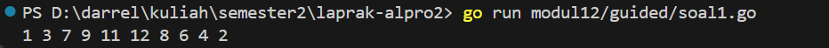
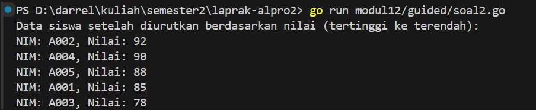
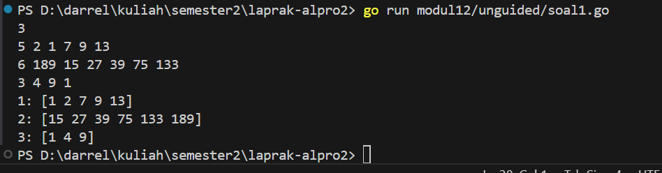
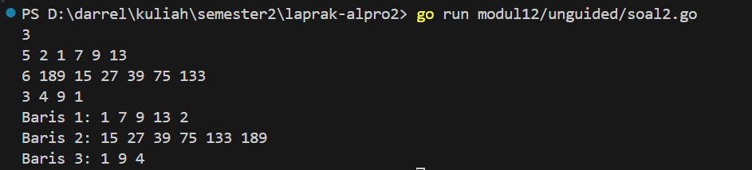
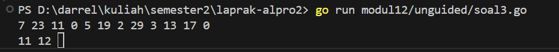
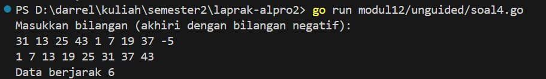
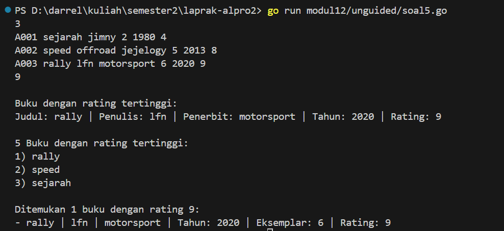

<h1 align="center">Laporan Praktikum Modul 12 & 13 <br>  PENGURUTAN DATA</h1> 

___
<h4 align="center">Gien Darrel Adli - 103112430008 </h4>

# Guided
### Soal-1. 
Diberikan `n` bilangan bulat positif. Buat program untuk mengurutkan angka ganjil secara **membesar (ascending)** dan angka genap secara **mengecil (descending)**, lalu gabungkan hasilnya dengan ganjil duluan.

Gunakan **selection sort** dalam proses pengurutan.
**Masukan:**
- Baris pertama berisi bilangan bulat `n` (1 ≤ n ≤ 100).
- Baris kedua berisi `n` bilangan bulat positif.
**Keluaran:**
- Satu baris berisi angka ganjil terurut membesar diikuti angka genap terurut mengecil.

**Contoh Masukan:**
```
10
12 7 3 2 9 6 8 1 11 4
```

**Contoh Keluaran:**
```
1 3 7 9 11 12 8 6 4 2
```
---
```go
package main

import "fmt"

func selectionSortAsc(arr []int, panjang int) {
	var temp, i, j, idxMin int
	for i = 0; i < panjang-1; i++ {
		idxMin = i
		for j = i + 1; j < panjang; j++ {
			if arr[j] < arr[idxMin] {
				idxMin = j
			}
		}
		temp = arr[idxMin]
		arr[idxMin] = arr[i]
		arr[i] = temp
	}
}

func selectionSortDesc(arr []int, panjang int) {
	var temp, i, j, idxMax int
	for i = 0; i < panjang-1; i++ {
		idxMax = i
		for j = i + 1; j < panjang; j++ {
			if arr[j] > arr[idxMax] {
				idxMax = j
			}
		}
		temp = arr[idxMax]
		arr[idxMax] = arr[i]
		arr[i] = temp
	}
}

func main() {
	n := 10
	numbers := []int{12, 7, 3, 2, 9, 6, 8, 1, 11, 4}

	var ganjil []int
	var genap []int

	for i := 0; i < n; i++ {
		if numbers[i]%2 == 1 {
			ganjil = append(ganjil, numbers[i])
		} else {
			genap = append(genap, numbers[i])
		}
	}

	selectionSortAsc(ganjil, len(ganjil))
	selectionSortDesc(genap, len(genap))

	for i := 0; i < len(ganjil); i++ {
		fmt.Print(ganjil[i], " ")
	}
	for i := 0; i < len(genap); i++ {
		fmt.Print(genap[i], " ")
	}
}

```


>Program ini mengambil 10 angka, memisahkannya menjadi bilangan ganjil dan genap, lalu mengurutkan ganjil secara ascending (kecil ke besar) dan genap secara descending (besar ke kecil) menggunakan algoritma selection sort. Setelah diurutkan, hasil dari dua kelompok angka tersebut dicetak berurutan: ganjil dulu, lalu genap, semuanya dalam satu baris.


### Soal-2. 
Sebuah kelas memiliki sejumlah siswa yang telah mengikuti ujian. Tugas Anda adalah membuat program yang membaca nilai-nilai ujian siswa dengan struct berisikan `nim` dan `nilai`, lalu mengurutkannya dari yang tertinggi ke yang terendah menggunakan **insertion sort**.
**Masukan:**
- Baris pertama adalah sebuah bilangan bulat `n` (1 ≤ n ≤ 100), menyatakan jumlah siswa.
- Baris berikutnya berisi `n` bilangan bulat yang masing-masing adalah nilai ujian (0–100).
**Keluaran:**
- Satu baris berisi nilai-nilai yang sudah terurut dari terbesar ke terkecil.
**Contoh Masukan:**

```
6
75 60 90 80 100 65
```
**Contoh Keluaran:**

```
100 90 80 75 65 60
```

```go
package main

import "fmt"

type Siswa struct {
	NIM   string
	Nilai int
}

func insertionSort(data []Siswa) {
	for i := 1; i < len(data); i++ {
		key := data[i]
		j := i - 1

		for j >= 0 && data[j].Nilai < key.Nilai {
			data[j+1] = data[j]
			j--
		}
		data[j+1] = key
	}
}

func main() {
	siswa := []Siswa{
		{"A001", 85},
		{"A002", 92},
		{"A003", 78},
		{"A004", 90},
		{"A005", 88},
	}

	insertionSort(siswa)

	fmt.Println("Data siswa setelah diurutkan berdasarkan nilai (tertinggi ke terendah):")
	for _, s := range siswa {
		fmt.Printf("NIM: %s, Nilai: %d\n", s.NIM, s.Nilai)
	}
}

```


>Program ini mendefinisikan tipe data Siswa yang menyimpan NIM dan nilai, lalu membuat daftar siswa dengan data awal. Program kemudian mengurutkan daftar tersebut berdasarkan nilai secara menurun (dari tertinggi ke terendah) menggunakan algoritma insertion sort. Setelah proses pengurutan, program mencetak data semua siswa yang sudah terurut berdasarkan nilainya, dimulai dari yang memiliki nilai tertinggi.

# Unguided

## SELECTION
### Soal-1. 
Hercules, preman terkenal seantero ibukota, memiliki kerabat di banyak daerah. Tentunya
Hercules sangat suka mengunjungi semua kerabatnya itu. Diberikan masukan nomor rumah dari semua kerabatnya di suatu daerah, buatlah program rumahkerabat yang akan menyusun nomor-nomor rumah kerabatnya secara terurut membesar menggunakan algoritma selection sort.
Masukan dimulai dengan sebuah integer 𝒏 (0 < n < 1000), banyaknya daerah kerabat Hercules tinggal. Isi 𝒏 baris berikutnya selalu dimulai dengan sebuah integer 𝒎 (0 < m <2) yang menyatakan banyaknya rumah kerabat di daerah tersebut, diikuti dengan rangkaian bilangan bulat positif, nomor rumah para kerabat. Keluaran terdiri dari n baris, yaitu rangkaian rumah kerabatnya terurut membesar di masing-masing daerah.
```go
package main

import "fmt"

func UrutkanAngka(daftar []int) {
	for i := 0; i < len(daftar)-1; i++ {
		posisiTerkecil := i
		for j := i + 1; j < len(daftar); j++ {
			if daftar[j] < daftar[posisiTerkecil] {
				posisiTerkecil = j
			}
		}
		daftar[i], daftar[posisiTerkecil] = daftar[posisiTerkecil], daftar[i]
	}
}

func ProsesData() {
	var jumlahBaris int
	var kumpulanData [][]int

	fmt.Scanln(&jumlahBaris)

	for baris := 0; baris < jumlahBaris; baris++ {
		var elemenBaris []int
		var banyakAngka int

		fmt.Scan(&banyakAngka)

		for i := 0; i < banyakAngka; i++ {
			var nilai int
			fmt.Scan(&nilai)
			elemenBaris = append(elemenBaris, nilai)
		}

		UrutkanAngka(elemenBaris)
		kumpulanData = append(kumpulanData, elemenBaris)
	}

	for idx, elemen := range kumpulanData {
		fmt.Printf("%d: %v\n", idx+1, elemen)
	}
}

func main() {
	ProsesData()
}
```

>Program tersebut ditulis dalam bahasa Go dan berfungsi untuk membaca sejumlah baris data dari input, di mana setiap baris berisi beberapa angka, lalu mengurutkan angka-angka dalam setiap baris secara menaik (ascending) menggunakan algoritma selection sort. Setelah itu, program mencetak hasil pengurutan untuk setiap baris. Proses dimulai dengan membaca jumlah baris yang ingin dimasukkan, kemudian untuk setiap baris, pengguna diminta memasukkan jumlah angka dan angka-angkanya sendiri. Angka-angka tersebut dimasukkan ke dalam slice, diurutkan, lalu disimpan dalam sebuah slice dua dimensi.

### Soal-2. 
Belakangan diketahui ternyata Hercules itu tidak berani menyeberang jalan, maka selalu
diusahakan agar hanya menyeberang jalan sesedikit mungkin, hanya diujung jalan. Karena
nomor rumah sisi kiri jalan selalu ganjil dan sisi kanan jalan selalu genap, maka buatlah
program kerabat dekat yang akan menampilkan nomor rumah mulai dari nomor yang ganjil
lebih dulu terurut membesar dan kemudian menampilkan nomor rumah dengan nomor
genap terurut mengecil. Format Masukan masih persis sama seperti sebelumnya. Keluaran terdiri dari n baris, yaitu rangkaian rumah kerabatnya terurut membesar untuk nomor ganjil, diikuti dengan terurut mengecil untuk nomor genap, di masing-masing daerah. Keterangan: Terdapat 3 daerah dalam contoh masukan. Baris kedua berisi campuranbilangan ganjil dan genap. Baris berikutnya hanya berisi bilangan ganjil, dan baris terakhir hanya berisi bilangan genap.
Petunjuk:
• Waktu pembacaan data, bilangan ganjil dan genap dipisahkan ke dalam dua array
yang berbeda, untuk kemudian masing-masing diurutkan tersendiri.
• Atau, tetap disimpan dalam satu array, diurutkan secara keseluruhan. Tetapi pada
waktu pencetakan, mulai dengan mencetak semua nilai ganjil lebih dulu, kemudian
setelah selesai cetaklah semua nilai genapnya
```go
package main

import (
	"fmt"
	"sort"
)

func PisahDanUrut(data []int) []int {
	var ganjil []int
	var genap []int

	for _, angka := range data {
		if angka%2 == 1 {
			ganjil = append(ganjil, angka)
		} else {
			genap = append(genap, angka)
		}
	}

	sort.Ints(ganjil)
	sort.Sort(sort.Reverse(sort.IntSlice(genap)))
	return append(ganjil, genap...)
}

func main() {
	var jumlahBaris int
	fmt.Scanln(&jumlahBaris)

	var hasil [][]int

	for i := 0; i < jumlahBaris; i++ {
		var banyakAngka int
		fmt.Scan(&banyakAngka)

		data := make([]int, banyakAngka)
		for j := 0; j < banyakAngka; j++ {
			fmt.Scan(&data[j])
		}

		urutan := PisahDanUrut(data)
		hasil = append(hasil, urutan)
	}

	for i, baris := range hasil {
		fmt.Printf("Baris %d: ", i+1)
		for _, angka := range baris {
			fmt.Printf("%d ", angka)
		}
		fmt.Println()
	}
}
```

>Program ini ditulis dalam bahasa Go dan bertujuan untuk memproses beberapa baris data angka. Untuk setiap baris, program memisahkan angka ganjil dan genap, lalu mengurutkan angka ganjil secara menaik dan angka genap secara menurun. Hasil pengurutan dari setiap baris kemudian digabungkan dengan angka ganjil di depan dan genap di belakang. Proses dimulai dengan membaca jumlah baris, lalu untuk setiap baris, membaca jumlah angka dan isi angkanya. Fungsi PisahDanUrut digunakan untuk memisahkan dan mengurutkan angka-angka tersebut. Setelah semua baris diproses, hasil akhir ditampilkan ke layar dengan format "Baris x: ..." yang menunjukkan isi angka yang telah diurutkan sesuai ketentuan.

### Soal-3. 
Kompetisi pemrograman yang baru saja berlalu diikuti oleh 17 tim dari berbagai perguruan
tinggi ternama. Dalam kompetisi tersebut, setiap tim berlomba untuk menyelesaikan
sebanyak mungkin problem yang diberikan. Dari 13 problem yang diberikan, ada satu
problem yang menarik. Problem tersebut mudah dipahami, hampir semua tim mencoba
untuk menyelesaikannya, tetapi hanya 3 tim yang berhasil. Apa sih problemnya?
"Median adalah nilai tengah dari suatu koleksi data yang sudah terurut. Jika jumlah data
genap, maka nilai median adalah rerata dari kedua nilai tengahnya. Pada problem ini, semua
data merupakan bilangan bulat positif, dan karenanya rerata nilai tengah dibulatkan ke
bawah."
Buatlah program median yang mencetak nilai median terhadap seluruh data yang sudah
terbaca, jika data yang dibaca saat itu adalah 0.
Masukan berbentuk rangkaian bilangan bulat. Masukan tidak akan berisi lebih dari 1000000
data, tidak termasuk bilangan 0. Data 0 merupakan tanda bahwa median harus dicetak, tidak
termasuk data yang dicari mediannya. Data masukan diakhiri dengan bilangan bulat -5313.
Keluaran adalah median yang diminta, satu data per baris.
```go
package main

import (
	"fmt"
	"sort"
)

func main() {
	var angka int
	var data []int

	for {
		fmt.Scan(&angka)
		if angka == -5313 {
			break
		}
		if angka == 0 {
			salinan := make([]int, len(data))
			copy(salinan, data)
			sort.Ints(salinan)

			n := len(salinan)
			if n%2 == 1 {
				fmt.Print(salinan[n/2], " ")
			} else {
				median := (salinan[n/2-1] + salinan[n/2]) / 2
				fmt.Print(median, " ")
			}
		} else {
			data = append(data, angka)
		}
	}
}
```

>Program ini membaca deretan angka hingga menemukan -5313 sebagai penanda akhir. Setiap angka (kecuali 0 dan -5313) disimpan dalam array. Saat program membaca angka 0, data yang sudah masuk akan disalin, diurutkan, lalu dihitung mediannya. Jika jumlah data ganjil, median adalah nilai tengah; jika genap, median adalah rata-rata dua nilai tengah. Hasil median dicetak ke layar dengan spasi sebagai pemisah.


## INSERTION
### Soal-4. 
Buatlah sebuah program yang digunakan untuk membaca data integer seperti contoh yang
diberikan di bawah ini, kemudian diurutkan (menggunakan metoda insertion sort), dan
memeriksa apakah data yang terurut berjarak sama terhadap data sebelumnya.
Masukan terdiri dari sekumpulan bilangan bulat yang diakhiri oleh bilangan negatif. Hanya
bilangan non negatif saja yang disimpan ke dalam array.
Keluaran terdiri dari dua baris. Baris pertama adalah isi dari array setelah dilakukan
pengurutan, sedangkan baris kedua adalah status jarak setiap bilangan yang ada di dalam
array. "Data berjarak x" atau "data berjarak tidak tetap".
```go
package main

import (
	"fmt"
)

func insertionSort(arr []int) {
	for i := 1; i < len(arr); i++ {
		key := arr[i]
		j := i - 1
		for j >= 0 && arr[j] > key {
			arr[j+1] = arr[j]
			j--
		}
		arr[j+1] = key
	}
}

func cekJarakTetap(arr []int) string {
	if len(arr) < 2 {
		return "Data berjarak tidak tetap"
	}
	jarak := arr[1] - arr[0]
	for i := 2; i < len(arr); i++ {
		if arr[i]-arr[i-1] != jarak {
			return "Data berjarak tidak tetap"
		}
	}
	return fmt.Sprintf("Data berjarak %d", jarak)
}

func main() {
	var input int
	data := []int{}

	fmt.Println("Masukkan bilangan (akhiri dengan bilangan negatif):")
	for {
		_, err := fmt.Scan(&input)
		if err != nil || input < 0 && len(data) == 0 {
			break
		}
		if input < 0 {
			break
		}
		data = append(data, input)
	}

	insertionSort(data)

	for _, val := range data {
		fmt.Printf("%d ", val)
	}
	fmt.Println()

	fmt.Println(cekJarakTetap(data))
}

```


>Program ini menerima input angka dari pengguna, mengurutkannya menggunakan insertion sort, dan memeriksa apakah jarak antar angka selalu sama. Jika jaraknya tetap, program akan mencetak jarak tersebut, kalau tidak, program akan menginformasikan bahwa jaraknya tidak tetap.

### Soal-5
Sebuah program perpustakaan digunakan untuk mengelola data buku di dalam suatu
perpustakaan. Misalnya terdefinisi struct dan array seperti berikut ini:

const nMax : integer = 7919
type Buku = <
id, judul, penulis, penerbit : string
eksemplar, tahun, rating : integer >
type DaftarBuku = array [ 1..nMax] of Buku
Pustaka : DaftarBuku
nPustaka: integer

Masukan terdiri dari beberapa baris. Baris pertama adalah bilangan bulat N yang
menyatakan banyaknya data buku yang ada di dalam perpustakaan. N baris berikutnya,
masing-masingnya adalah data buku sesuai dengan atribut atau field pada struct. Baris
terakhir adalah bilangan bulat yang menyatakan rating buku yang akan dicari.

Keluaran terdiri dari beberapa baris. Baris pertama adalah data buku terfavorit, baris kedua
adalah lima judul buku dengan rating tertinggi, selanjutnya baris terakhir adalah data buku
yang dicari sesuai rating yang diberikan pada masukan baris terakh
```go
package main

import (
	"fmt"
)

const maxBuku = 7919

type Buku struct {
	id, judul, penulis, penerbit string
	jumlah, tahun, rating        int
}

type KoleksiBuku [maxBuku]Buku

func inputBuku(data *KoleksiBuku, total *int) {
	fmt.Scan(total)
	for i := 0; i < *total; i++ {
		fmt.Scan(
			&data[i].id, &data[i].judul, &data[i].penulis,
			&data[i].penerbit, &data[i].jumlah,
			&data[i].tahun, &data[i].rating)
	}
}

func tampilkanFavorit(b KoleksiBuku, n int) {
	maxIndex := 0
	for i := 1; i < n; i++ {
		if b[i].rating > b[maxIndex].rating {
			maxIndex = i
		}
	}
	fmt.Println("\nBuku dengan rating tertinggi:")
	fav := b[maxIndex]
	fmt.Printf("Judul: %s | Penulis: %s | Penerbit: %s | Tahun: %d | Rating: %d\n",
		fav.judul, fav.penulis, fav.penerbit, fav.tahun, fav.rating)
}

func urutkanBerdasarkanRating(data *KoleksiBuku, jumlah int) {
	for i := 1; i < jumlah; i++ {
		temp := data[i]
		j := i - 1
		for j >= 0 && data[j].rating < temp.rating {
			data[j+1] = data[j]
			j--
		}
		data[j+1] = temp
	}
}

func tampilkanTop5(b KoleksiBuku, total int) {
	batas := 5
	if total < 5 {
		batas = total
	}

	fmt.Println("\n5 Buku dengan rating tertinggi:")
	for i := 0; i < batas; i++ {
		fmt.Printf("%d) %s\n", i+1, b[i].judul)
	}
}

func cariBerdasarkanRating(b KoleksiBuku, n, target int) {
	kiri, kanan := 0, n-1
	var hasil []Buku

	for kiri <= kanan {
		tengah := (kiri + kanan) / 2
		if b[tengah].rating == target {
			// temukan semua dengan rating yang sama
			i := tengah
			for i >= 0 && b[i].rating == target {
				i--
			}
			i++
			for i < n && b[i].rating == target {
				hasil = append(hasil, b[i])
				i++
			}
			break
		} else if b[tengah].rating < target {
			kanan = tengah - 1
		} else {
			kiri = tengah + 1
		}
	}

	if len(hasil) > 0 {
		fmt.Printf("\nDitemukan %d buku dengan rating %d:\n", len(hasil), target)
		for _, buku := range hasil {
			fmt.Printf("- %s | %s | %s | Tahun: %d | Eksemplar: %d | Rating: %d\n",
				buku.judul, buku.penulis, buku.penerbit, buku.tahun, buku.jumlah, buku.rating)
		}
	} else {
		fmt.Println("\nTidak ada buku yang memiliki rating tersebut.")
	}
}

func main() {
	var perpustakaan KoleksiBuku
	var jumlahBuku, ratingDicari int

	inputBuku(&perpustakaan, &jumlahBuku)
	fmt.Scan(&ratingDicari)

	urutkanBerdasarkanRating(&perpustakaan, jumlahBuku)
	tampilkanFavorit(perpustakaan, jumlahBuku)
	tampilkanTop5(perpustakaan, jumlahBuku)
	cariBerdasarkanRating(perpustakaan, jumlahBuku, ratingDicari)
}
```


>Program ini menghitung jumlah suara masuk dan suara sah untuk pemilihan ketua dan wakil ketua RT. Input suara terus diterima hingga angka 0 dimasukkan. Suara yang valid adalah angka antara 1 hingga 20. Setelah itu, program menentukan ketua dan wakil ketua berdasarkan suara terbanyak, dengan prioritas pada calon dengan nomor lebih kecil jik
