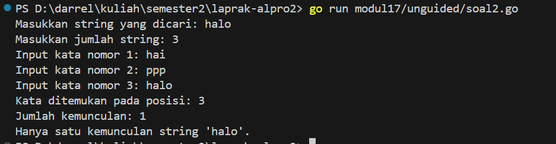

<h1 align="center">Laporan Praktikum Modul 17 <br>   SKEMA PEMROSESAN SEKUENSIAL</h1> 

___
<h4 align="center">Gien Darrel Adli - 103112430008 </h4>

# Guided
### Soal-1. 
Aldi memiliki daftar nilai ulangan matematika temannya: 75, 60, 90, 85, dan 70. Ia ingin mengurutkan nilai tersebut dari yang terkecil ke yang terbesar menggunakan **metode Bubble Sort**.

**Pertanyaan:**
1. Tunjukkan proses pengurutan nilai menggunakan Bubble Sort **hingga semua nilai terurut.**
2. Berapa kali pertukaran (swap) terjadi dalam proses ini?

```go
package main

import "fmt"

func main() {
	nilai := []int{75, 60, 90, 85, 70}
	n := len(nilai)
	swapCount := 0

	fmt.Println("Proses Bubble Sort:")

	for i := 0; i < n; i++ {
		fmt.Printf("swap ke-%d: %v\n", i+1, nilai)
		for j := 0; j < n-i-1; j++ {
			if nilai[j] > nilai[j+1] {
				nilai[j], nilai[j+1] = nilai[j+1], nilai[j]
				swapCount++
			}
		}
	}

	fmt.Printf("\nHasil setelah diurutkan: %v\n", nilai)
	fmt.Printf("Jumlah pertukaran: %d kali\n", swapCount)
}

```

>Program ini mengurutkan array nilai menggunakan algoritma Bubble Sort secara menaik. Di setiap iterasi (pass), program mencetak kondisi array sebelum melakukan pertukaran. Jika dua elemen bersebelahan dalam array tidak berurutan, maka keduanya ditukar, dan jumlah pertukaran dihitung. Setelah proses selesai, program menampilkan array yang sudah terurut dan total jumlah pertukaran yang dilakukan.

# Unguided
### Soal-1. 
Diberikan sejumlah bilangan real yang diakhiri dengan marker 9999, cari rerata dari bilangan-
bilangan tersebut.
```go
package main

import (
	"fmt"
)

func main() {
	var (
		angka      float64
		jumlah     float64
		jumlahData int
	)

	fmt.Println("Masukkan bilangan real satu per satu (akhiri dengan 9999):")

	for {
		fmt.Print("Input: ")
		fmt.Scan(&angka)

		if angka == 9999 {
			break
		}
		jumlah += angka
		jumlahData++
	}

	if jumlahData > 0 {
		rataRata := jumlah / float64(jumlahData)
		fmt.Printf("Rata-rata dari bilangan yang dimasukkan adalah: %.2f\n", rataRata)
	} else {
		fmt.Println("Tidak ada bilangan yang dimasukkan.")
	}
}
```

>Program tersebut meminta pengguna untuk memasukkan bilangan real satu per satu. Input dihentikan jika pengguna memasukkan angka 9999. Setiap bilangan yang dimasukkan akan dijumlahkan, dan program mencatat berapa banyak bilangan yang dimasukkan. Setelah input selesai, jika ada data, program menghitung rata-rata dengan membagi total jumlah bilangan dengan jumlah data, lalu menampilkannya. Jika tidak ada bilangan dimasukkan, program menampilkan pesan bahwa tidak ada input.

### Soal-2. 
Diberikan string x dan n buah string. x adalah data pertama yang dibaca, n adalah data
bilangan yang dibaca kedua, dan n data berikutnya adalah data string. Buat algoritma untuk
menjawab pertanyaan berikut:
a. Apakah string x ada dalam kumpulan n data string tersebut?
b. Pada posisi ke berapa string x tersebut ditemukan?
c. Ada berapakah string x dalam kumpulan n data string tersebut?
d. Adakah sedikitnya dua string x dalam n data string tersebut?
```go
package main

import (
	"fmt"
)

func casiString(kata string, jumlah int) {
	var hasilPosisi []int

	for nomor := 1; nomor <= jumlah; nomor++ {
		var masukan string
		fmt.Printf("Input kata nomor %d: ", nomor)
		fmt.Scanln(&masukan)

		if masukan == kata {
			hasilPosisi = append(hasilPosisi, nomor)
		}
	}

	if len(hasilPosisi) == 0 {
		fmt.Println("Kata tidak ditemukan.")
		return
	}

	fmt.Print("Kata ditemukan pada posisi: ")
	for i, posisi := range hasilPosisi {
		if i > 0 {
			fmt.Print(", ")
		}
		fmt.Print(posisi)
	}
	fmt.Println()
	fmt.Printf("Jumlah kemunculan: %d\n", len(hasilPosisi))

	if len(hasilPosisi) > 1 {
		fmt.Printf("Terdapat lebih dari satu kemunculan string '%s'.\n", kata)
	} else {
		fmt.Printf("Hanya satu kemunculan string '%s'.\n", kata)
	}
}

func main() {
	var kataCari string
	var banyakData int

	fmt.Print("Masukkan string yang dicari: ")
	fmt.Scanln(&kataCari)

	fmt.Print("Masukkan jumlah string: ")
	fmt.Scanln(&banyakData)

	casiString(kataCari, banyakData)
}
```

>Program ini menerima input sebuah kata yang ingin dicari dan jumlah data string yang akan dimasukkan. Kemudian program meminta pengguna memasukkan kata-kata satu per satu sebanyak jumlah data yang ditentukan. Setiap kata yang dimasukkan dibandingkan dengan kata yang dicari, dan jika sama, posisi kata tersebut disimpan. Setelah semua input selesai, program menampilkan posisi-posisi di mana kata ditemukan beserta jumlah kemunculannya. Jika kata muncul lebih dari sekali, program menginformasikan bahwa ada lebih dari satu kemunculan, jika hanya sekali, program menyatakan hanya ada satu kemunculan. Jika kata tidak ditemukan sama sekali, program menyampaikan bahwa kata tersebut tidak ditemukan.

### Soal-3. 
Empat daerah A, B, C, dan D yang berdekatan ingin mengukur curah hujan. Keempat daerah
tersebut digambarkan pada bidang berikut:
Gambar 1. Ilustrasi denah daerah yang digunakan untuk mengukur curah hujan
Misal curah hujan dihitung berdasarkan banyaknya tetesan air hujan. Setiap tetesan
berukuran 0.0001 ml curah hujan. Tetesan air hujan turun secara acak dari titik (0,0) sampai
(1,1). Jika diterima input yang menyatakan banyaknya tetesan air hujan. Tentukan curah
hujan untuk keempat daerah tersebut.
Buatlah program yang menerima input berupa banyaknya tetesan air hujan. Kemudian buat
koordinat/titik (x, y) secara acak dengan menggunakan fungsi rand.Float64(). Hitung dan
tampilkan banyaknya tetesan yang jatuh pada daerah A, B, C dan D. Konversikan satu tetesan
berukuran 0.0001 milimeter.
Catatan: Lihat lampiran untuk informasi menggunakan paket math/rand untuk menggunakan
rand.Float64() yang menghasilkan bilangan riil acak
```go
package main

import (
	"fmt"
	"math/rand"
	"time"
)

func main() {
	var tetesan int
	fmt.Print("Masukkan jumlah tetesan air hujan: ")
	fmt.Scanln(&tetesan)

	rand.Seed(time.Now().UnixNano())

	var countA, countB, countC, countD int

	for i := 0; i < tetesan; i++ {
		x := rand.Float64()
		y := rand.Float64()

		if x < 0.5 && y < 0.5 {
			countA++
		} else if x >= 0.5 && y < 0.5 {
			countB++
		} else if x < 0.5 && y >= 0.5 {
			countC++
		} else {
			countD++
		}
	}

	const volumePerDrop = 0.1

	fmt.Printf("Curah hujan daerah A: %.4f milimeter\n", float64(countA)*volumePerDrop)
	fmt.Printf("Curah hujan daerah B: %.4f milimeter\n", float64(countB)*volumePerDrop)
	fmt.Printf("Curah hujan daerah C: %.4f milimeter\n", float64(countC)*volumePerDrop)
	fmt.Printf("Curah hujan daerah D: %.4f milimeter\n", float64(countD)*volumePerDrop)
}
```

>tetesan air hujan. Setiap tetesan diwakili oleh titik acak (x, y) dengan nilai antara 0 dan 1. Berdasarkan posisi titik tersebut, tetesan akan dikategorikan ke salah satu dari empat daerah: A, B, C, atau D, yang masing-masing merepresentasikan kuadran dalam kotak 1x1.

Jika titik berada di kiri bawah (x < 0.5 && y < 0.5), maka itu termasuk ke daerah A. Jika berada di kanan bawah (x >= 0.5 && y < 0.5), masuk ke daerah B. Jika di kiri atas (x < 0.5 && y >= 0.5), masuk ke daerah C. Sisanya (kanan atas) masuk ke daerah D.

Setiap tetesan dianggap memiliki volume tetap sebesar 0.1 milimeter. Setelah semua titik dibangkitkan dan dikategorikan, program menghitung total curah hujan untuk masing-masing daerah dan menampilkannya dalam satuan milimeter.

### Soal-4. 
Berdasarkan formula Leibniz, nilai π dapat dinyatakan sebagai deret harmonik ganti sebagai
berikut:
Suku ke-i dinyatakan sebagai 𝑆𝑖 dan jumlah deret adalah 𝑆. Apabila diketahui suku pertama
𝑆1 = 1, suku kedua 𝑆2 = −1/3 Temukan rumus untuk suku ke-𝒊 atau 𝑆𝑖.
Berdasarkan rumus tersebut, buatlah program yang menghitung 𝑆 untuk 1000000 suku
pertama.
Perhatikan contoh sesi interaksi program di bawah ini (teks bergaris bawah adalah
input/read):
N suku pertama: 1000000
Hasil PI: 3.1415951

Setelah jalan, modifikasi program tersebut agar menyimpan nilai dua suku yang
bersebelahan, 𝑆𝑖 dan 𝑆𝑖+1. Buatlah agar program tersebut sekarang berhenti apabila selisih
dari kedua suku tersebut tidak lebih dari 0.00001.
Perhatikan contoh sesi interaksi program di bawah ini (teks bergaris bawah adalah
input/read):
N suku pertama: 1000000
Hasil PI: 3.1415876535
Hasil PI: 3.1415976535
Pada i ke: 200002
```go
package main

import (
	"fmt"
	"math"
)

func main() {
	var maxN int
	fmt.Print("N suku pertama: ")
	fmt.Scan(&maxN)

	S := 0.0
	lastPi := 0.0
	var pi float64

	for i := 0; i < maxN; i++ {
		term := 1.0 / float64(2*i+1)
		if i%2 != 0 {
			term *= -1
		}
		S += term
		pi = 4 * S

		if math.Abs(pi-lastPi) <= 0.00001 {
			fmt.Printf("Hasil PI: %.9f\n", lastPi)
			fmt.Printf("Hasil PI: %.9f\n", pi)
			fmt.Printf("Pada i ke: %d\n", i)
			return
		}

		lastPi = pi
	}

	fmt.Printf("Hasil PI: %.9f\n", pi)
}
```


>Program ini menghitung pendekatan nilai pi menggunakan rumus deret matematika. Pengguna memasukkan jumlah suku N yang ingin dihitung. Setiap suku dihitung dan dijumlahkan, lalu dikalikan 4 untuk mendapatkan nilai pi. Jika dua hasil π berturut-turut sudah hampir sama (selisihnya sangat kecil), program berhenti lebih awal dan mencetak hasilnya.

### Soal-5
Monti bekerja pada sebuah kedai pizza, saking ramainya kedai tersebut membuat Monti tidak
ada waktu untuk bersantai. Suatu ketika saat sedang menaburkan topping pada pizza yang
diletakkan pada wadah berbentuk persegi, terpikirkan oleh Monti cara menghitung berapa
banyak topping yang dia butuhkan, dan cara menghitung nilai 𝝅. Ilustrasi seperti gambar yang diberikan di bawah, topping adalah lingkaran-lingkaran kecil. Ada yang tepat berada di atas pizza, dan ada yang jatuh di dalam kotak tetapi berada di luar pizza. Apabila luas pizza yang memiliki radius r adalah 𝐿𝑢𝑎𝑠𝑃𝑖𝑧𝑧𝑎 = 𝜋𝑟2 dan luas wadah pizza yang memiliki panjang sisi 𝑑 = 2𝑟 adalah 𝐿𝑢𝑎𝑠𝑊𝑎𝑑𝑎ℎ = 𝑑2 = 4𝑟2, maka diperoleh perbandingan luas kedua bidang tersebut.Pada ilustrasi topping berbentuk bulat kecil merah dan biru pada gambar adalah titik-titik(𝑥, 𝑦) acak pada sebuah wadah yang berisi pizza. Dengan jumlah yang sangat banyak danditaburkan merata (secara acak), maka kita bisa mengetahui berapa banyak titik/topping yangberada tepat di dalam pizza menggunakan ketidaksamaan di atas.

Buatlah program yang menerima input berupa banyaknya topping yang akan ditaburkan,
kemudian buat titik acak (𝑥, 𝑦) dari bilangan acak riil pada kisaran nilai 0 hingga 1 sebanyak
topping yang diberikan. Hitung dan tampilkan berapa banyak topping yang jatuh tepat di atas
pizza. Titik pusat pizza adalah (0.5, 0.5) dan jari-jari pizza adalah 0.5 satuan wadah.
Perhatikan contoh sesi interaksi program di bawah ini (teks bergaris bawah adalah
input/read):
Banyak Topping: 1234567
Topping pada Pizza: 969000

Apabila topping yang ditaburkan oleh Monti secara merata berjumlah yang sangat banyak,
maka topping akan menutupi keseluruhan wadah pizza. Luas Pizza sebanding dengan topping
yang berada pada pizza, sedangkan Luas Wadah sebanding dengan banyaknya topping yang
ditaburkan. Dengan menggunakan rumus perbandingan luas yang diberikan di atas, maka nilai
konstanta 𝜋 dapat dihitung.
Modifikasi program di atas sehingga dapat menghitung dan menampilkan nilai konstanta π.
Perhatikan contoh sesi interaksi program di bawah ini (teks bergaris bawah adalah
input/read):
Banyak Topping: 1234567
Topping pada Pizza: 969206
PI : 3.140229732
```go
package main

import (
	"fmt"
	"math/rand"
	"time"
)

func main() {
	var n int
	fmt.Print("Banyak Topping: ")
	fmt.Scan(&n)

	rand.Seed(time.Now().UnixNano())

	countInside := 0
	for i := 0; i < n; i++ {
		x := rand.Float64()
		y := rand.Float64()
		dx := x - 0.5
		dy := y - 0.5
		if dx*dx+dy*dy <= 0.25 {
			countInside++
		}
	}

	pi := 4.0 * float64(countInside) / float64(n)

	fmt.Printf("Topping pada Pizza: %d\n", countInside)
	fmt.Printf("PI : %.10f\n", pi)
}

```


>Program ini memperkirakan nilai pi dengan cara simulasi Monte Carlo. Program meminta input jumlah titik (topping) yang akan ditempatkan secara acak dalam sebuah kotak berukuran 1x1. Titik-titik tersebut dianggap sebagai posisi topping pizza. Program kemudian menghitung berapa banyak titik yang jatuh di dalam lingkaran beradius 0.5 yang berada di tengah kotak tersebut. Dengan membandingkan banyak titik di lingkaran dengan total titik, program menghitung nilai pi berdasarkan rasio luas lingkaran terhadap luas persegi. Hasilnya ditampilkan berupa jumlah titik di dalam lingkaran dan nilai pi yang diperkirakan dari simulasi.
