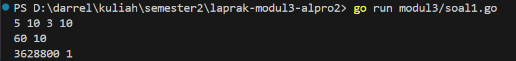
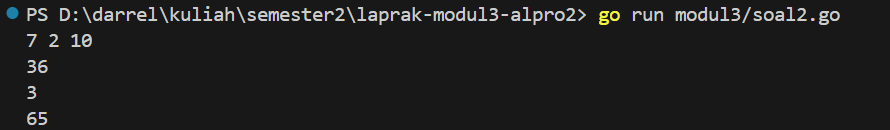
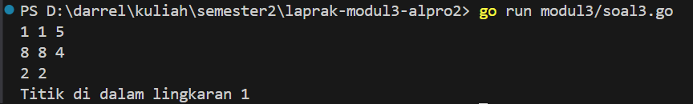

<h1 align="center">Laporan Praktikum Modul 3 <br> FUNGSI </h1> 

___
<h4 align="center">Gien Darrel Adli - 103112430008 </h4>

### Unguided

### Soal-1. 
Minggu ini, mahasiswa Fakultas Informatika mendapatkan tugas dari mata kuliah matematika
diskrit untuk mempelajari kombinasi dan permutasi. Jonas salah seorang mahasiswa, iseng
untuk mengimplementasikannya ke dalam suatu program. Oleh karena itu bersediakah kalian
membantu Jonas? (tidak tentunya ya :p)
Masukan terdiri dari empat buah bilangan asli 𝑎, 𝑏, 𝑐, dan 𝑑 yang dipisahkan oleh spasi,
dengan syarat 𝑎 ≥ 𝑐 dan 𝑏 ≥ 𝑑.
Keluaran terdiri dari dua baris. Baris pertama adalah hasil permutasi dan kombinasi 𝒂
terhadap 𝑐, sedangkan baris kedua adalah hasil permutasi dan kombinasi 𝑏 terhadap 𝑑.
Catatan: permutasi (P) dan kombinasi (C) dari 𝑛 terhadap 𝑟 (𝑛 ≥ 𝑟) dapat dihitung dengan
menggunakan persamaan berikut!
```go
package main

import "fmt"

func factorial(n int) int {

    result := 1
    
    for i := 2; i <= n; i++ {
        result *= i
    }
    return result
}

func permutation(n, r int) int {

    if n < r {
        return 0
    }
    return factorial(n) / factorial(n-r)
}

func combination(n, r int) int {

    if n < r {
        return 0
    }
    return permutation(n, r) / factorial(r)
}

func main() {

    var a, b, c, d int
    fmt.Scan(&a, &b, &c, &d)

    fmt.Println(permutation(a, c), combination(a, c))
    fmt.Println(permutation(b, d), combination(b, d))
}
```

Kode ini merupakan implementasi dalam bahasa Go untuk menghitung nilai permutasi dan kombinasi dari dua pasang bilangan bulat yang dimasukkan oleh pengguna. Fungsi factorial() digunakan untuk menghitung nilai faktorial suatu bilangan. Fungsi permutation(n, r) menghitung banyaknya cara menyusun r objek dari n objek yang tersedia, sedangkan combination(n, r) menghitung banyaknya cara memilih r objek dari n objek tanpa memperhatikan urutan. Program membaca empat bilangan dari input, lalu menghitung dan mencetak hasil permutasi serta kombinasi untuk dua pasang bilangan tersebut.

### Soal-2
Diberikan tiga buah fungsi matematika yaitu 𝑓 (𝑥) = 𝑥2 , 𝑔 (𝑥) = 𝑥 − 2 dan ℎ (𝑥) = 𝑥 +
1. Fungsi komposisi (𝑓𝑜𝑔𝑜ℎ)(𝑥) artinya adalah 𝑓(𝑔(ℎ(𝑥))). Tuliskan 𝑓(𝑥), 𝑔(𝑥) dan ℎ(𝑥)
dalam bentuk function.

Masukan terdiri dari sebuah bilangan bulat 𝑎, 𝑏 dan 𝑐 yang dipisahkan oleh spasi.
Keluaran terdiri dari tiga baris. 

Baris pertama adalah (𝑓𝑜𝑔𝑜ℎ)(𝑎), baris kedua (𝑔𝑜ℎ𝑜𝑓)(𝑏), dan baris ketiga adalah (ℎ𝑜𝑓𝑜𝑔)(𝑐)!
```go
package main

import "fmt"

func hitungKomposisi(a, b, c int) (int, int, int) {

    f := func(x int) int { return x * x }
    g := func(x int) int { return x - 2 }
    h := func(x int) int { return x + 1 }

    fogoh := f(g(h(a)))
    gohof := g(h(f(b)))
    hofog := h(f(g(c)))

    return fogoh, gohof, hofog
}

func main() {

    var a, b, c int
    fmt.Scan(&a, &b, &c)

    x, y, z := hitungKomposisi(a, b, c)

    fmt.Println(x)
    fmt.Println(y)
    fmt.Println(z)
}
```

Kode ini menghitung komposisi tiga fungsi matematika dengan menerapkan fungsi f(x)=x2f(x) = x^2f(x)=x2, g(x)=x−2g(x) = x - 2g(x)=x−2, dan h(x)=x+1h(x) = x + 1h(x)=x+1 pada tiga bilangan yang diberikan sebagai input. Fungsi hitungKomposisi melakukan perhitungan untuk tiga kombinasi komposisi fungsi yang berbeda, yaitu fogoh(a), gohof(b), dan hofog(c), lalu mengembalikan hasilnya. Di dalam main, program membaca tiga angka dari input, memanggil fungsi tersebut, dan mencetak hasilnya ke layar.

### Soal-3
[Lingkaran] Suatu lingkaran didefinisikan dengan koordinat titik pusat (𝑐𝑥, 𝑐𝑦) dengan radius
𝑟. Apabila diberikan dua buah lingkaran, maka tentukan posisi sebuah titik sembarang (𝑥, 𝑦)
berdasarkan dua lingkaran tersebut.
Masukan terdiri dari beberapa tiga baris. Baris pertama dan kedua adalah koordinat titik pusat
dan radius dari lingkaran 1 dan lingkaran 2, sedangkan baris ketiga adalah koordinat titik
sembarang. Asumsi sumbu x dan y dari semua titik dan juga radius direpresentasikan dengan
bilangan bulat.
Keluaran berupa string yang menyatakan posisi titik "Titik di dalam lingkaran 1 dan 2", "Titik
di dalam lingkaran 1", "Titik di dalam lingkaran 2", atau "Titik di luar lingkaran 1 dan 2"
```go
package main

import (
	"fmt"
	"math"
)

func jarak(x1, y1, x2, y2 int) float64 {
	return math.Sqrt(math.Pow(float64(x2-x1), 2) + math.Pow(float64(y2-y1), 2))
}

func dalamLingkaran(cx, cy, r, x, y int) bool {
	return jarak(cx, cy, x, y) <= float64(r)
}

func main() {
	var cx1, cy1, r1, cx2, cy2, r2, x, y int
	fmt.Scan(&cx1, &cy1, &r1)
	fmt.Scan(&cx2, &cy2, &r2)
	fmt.Scan(&x, &y)

	inside1 := dalamLingkaran(cx1, cy1, r1, x, y)
	inside2 := dalamLingkaran(cx2, cy2, r2, x, y)

	if inside1 && inside2 {
		fmt.Println("Titik di dalam lingkaran 1 dan 2")
	} else if inside1 {
		fmt.Println("Titik di dalam lingkaran 1")
	} else if inside2 {
		fmt.Println("Titik di dalam lingkaran 2")
	} else {
		fmt.Println("Titik di luar lingkaran 1 dan 2")
	}
}

```

Kode ini menentukan apakah sebuah titik berada di dalam satu atau dua lingkaran yang diberikan. Fungsi `jarak` menghitung jarak antara dua titik menggunakan rumus jarak Euclidean. Fungsi dalamLingkaran memeriksa apakah suatu titik berada di dalam lingkaran dengan membandingkan jaraknya dari pusat lingkaran dengan jari-jari lingkaran. Dalam `main`, program membaca koordinat pusat dan jari-jari dua lingkaran serta koordinat titik yang akan diuji. Kemudian, program menentukan apakah titik tersebut berada di dalam salah satu, kedua, atau tidak ada lingkaran, dan mencetak hasilnya sesuai kondisi tersebut.