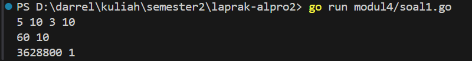
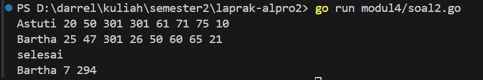

<h1 align="center">Laporan Praktikum Modul 4 <br> PROSEDUR </h1> 

___
<h4 align="center">Gien Darrel Adli - 103112430008 </h4>

### Unguided

### Soal-1. 
Minggu ini, mahasiswa Fakultas Informatika mendapatkan tugas dari mata kuliah matematika
diskrit untuk mempelajari kombinasi dan permutasi. Jonas salah seorang mahasiswa, iseng
untuk mengimplementasikannya ke dalam suatu program. Oleh karena itu bersediakah kalian
membantu Jonas? (tidak tentunya ya :p)
Masukan terdiri dari empat buah bilangan asli 𝑎, 𝑏, 𝑐, dan 𝑑 yang dipisahkan oleh spasi,
dengan syarat 𝑎 ≥ 𝑐 dan 𝑏 ≥ 𝑑.
Keluaran terdiri dari dua baris. Baris pertama adalah hasil permutasi dan kombinasi 𝒂
terhadap 𝑐, sedangkan baris kedua adalah hasil permutasi dan kombinasi 𝑏 terhadap 𝑑.
Catatan: permutasi (P) dan kombinasi (C) dari 𝑛 terhadap 𝑟 (𝑛 ≥ 𝑟) dapat dihitung dengan
menggunakan persamaan berikut!
𝑃(𝑛, 𝑟) = 𝑛! (𝑛−𝑟)! , sedangkan 𝐶(𝑛, 𝑟) = 𝑛! 𝑟!(𝑛−𝑟)!
```go
package main

import "fmt"

func factorial(n int) int {

    if n == 0 || n == 1 {
        return 1
    }
    result := 1

    for i := 2; i <= n; i++ {
        result *= i
    }
    return result
}  

func permutation(n, r int) int {

    if n < r {
        return 0
    }
    return factorial(n) / factorial(n-r)
}

  

func combination(n, r int) int {
    if n < r {

        return 0

    }
    return factorial(n) / (factorial(r) * factorial(n-r))
}

  

func main() {

    var a, b, c, d int

    fmt.Scan(&a, &b, &c, &d)

    p1 := permutation(a, c)
    c1 := combination(a, c)
    p2 := permutation(b, d)
    c2 := combination(b, d)

    fmt.Println(p1, c1)
    fmt.Println(p2, c2)
}
```


>Program ini menghitung permutasi dan kombinasi dari dua pasang bilangan yang dimasukkan. Pertama, ia membaca empat bilangan sebagai input. Lalu, menggunakan fungsi faktorial, program menghitung permutasi dan kombinasi untuk setiap pasangan bilangan. Hasilnya dicetak dalam dua baris sesuai dengan urutan input.

### Soal-2
Kompetisi pemrograman tingkat nasional berlangsung ketat. Setiap peserta diberikan 8 soal
yang harus dapat diselesaikan dalam waktu 5 jam saja. Peserta yang berhasil menyelesaikan
soal paling banyak dalam waktu paling singkat adalah pemenangnya.
Buat program gema yang mencari pemenang dari daftar peserta yang diberikan. Program
harus dibuat modular, yaitu dengan membuat prosedur hitungSkor yang mengembalikan total
soal dan total skor yang dikerjakan oleh seorang peserta, melalui parameter formal.
Pembacaan nama peserta dilakukan di program utama, sedangkan waktu pengerjaan dibaca
di dalam prosedur.
prosedure hitungSkor(in/out soal, skor : integer)
Setiap baris masukan dimulai dengan satu string nama peserta tersebut diikuti dengan adalah
8 integer yang menyatakan berapa lama (dalam menit) peserta tersebut menyelesaikan soal.
Jika tidak berhasil atau tidak mengirimkan jawaban maka otomatis dianggap menyelesaikan
dalam waktu 5 jam 1 menit (301 menit).
Satu baris keluaran berisi nama pemenang, jumlah soal yang diselesaikan, dan nilai yang
diperoleh. Nilai adalah total waktu yang dibutuhkan untuk menyelesaikan soal yang berhasil
diselesaikan.
```go
package main

import (
	"fmt"
)

func hitungSkor(waktu []int, soal *int, skor *int) {
	*soal = 0
	*skor = 0
	for _, t := range waktu {
		if t <= 300 {
			*soal++
			*skor += t
		}
	}
}

func main() {
	var nama string
	var waktu [8]int
	var pemenang string
	var maxSoal, totalSkor int
	var soal, skor int

	maxSoal = -1
	hasil := ""

	for {
		fmt.Scan(&nama)
		if nama == "selesai" {
			break
		}
		for i := 0; i < 8; i++ {
			fmt.Scan(&waktu[i])
		}
		hitungSkor(waktu[:], &soal, &skor)

		if soal > maxSoal || (soal == maxSoal && skor < totalSkor) {
			pemenang = nama
			maxSoal = soal
			totalSkor = skor
		}
	}

	if maxSoal != -1 {
		hasil = fmt.Sprintf("%s %d %d", pemenang, maxSoal, totalSkor)
	}

	fmt.Println(hasil)
}

```


>Codingan ini membaca data peserta yang mengikuti suatu kompetisi dan menentukan pemenangnya berdasarkan jumlah soal yang diselesaikan dalam waktu maksimal 300 detik. Jika ada lebih dari satu peserta dengan jumlah soal yang sama, peserta dengan total waktu penyelesaian lebih kecil yang akan menang. Fungsi hitungSkor menghitung jumlah soal yang diselesaikan dan total waktu yang digunakan dari array waktu yang diberikan. Di dalam `main`, program membaca input nama peserta dan delapan waktu pengerjaan soal. Jika nama yang dimasukkan adalah "selesai", maka input berhenti. Setiap peserta diproses menggunakan `hitungSkor`, dan jika peserta tersebut memiliki jumlah soal lebih banyak dari pemenang sebelumnya, atau jumlah soal yang sama tetapi dengan total waktu lebih kecil, maka peserta tersebut menjadi pemenang baru. Setelah semua data diproses, program mencetak nama pemenang, jumlah soal yang diselesaikan, dan total waktu yang digunakan.

### Soal-3
Skiena dan Revilla dalam Programming Challenges mendefinisikan sebuah deret bilangan.
Deret dimulai dengan sebuah bilangan bulat n. Jika bilangan n saat itu genap, maka suku
berikutnya adalah ½n, tetapi jika ganjil maka suku berikutnya bernilai 3n+1. Rumus yang sama
digunakan terus menerus untuk mencari suku berikutnya. Deret berakhir ketika suku terakhir
Halaman 9 | M o d u l P r a k t i k u m A l g o r i t m a P e m r o g r a m a n
bernilai 1. Sebagai contoh jika dimulai dengan n=22, maka deret bilangan yang diperoleh
adalah:
22 11 34 17 52 26 13 40 20 10 5 16 8 4 2 1
Untuk suku awal sampai dengan 1000000, diketahui deret selalu mencapai suku dengan nilai.
Buat program skiena yang akan mencetak setiap suku dari deret yang dijelaskan di atas untuk
nilai suku awal yang diberikan. Pencetakan deret harus dibuat dalam prosedur cetakDeret
yang mempunyai 1 parameter formal, yaitu nilai dari suku awal.
prosedure cetakDeret(in n : integer )
Masukan berupa satu bilangan integer positif yang lebih kecil dari 1000000.
Keluaran terdiri dari satu baris saja. Setiap suku dari deret tersebut dicetak dalam baris yang
dan dipisahkan oleh sebuah spasi.
```go
package main  

import "fmt"

func cetakDeret(n int) {
    for n != 1 {
        fmt.Print(n, " ")

        if n%2 == 0 {

            n /= 2
        } else {

            n = 3*n + 1
        }
    }
    fmt.Println(1)
}

func main() {

    var n int
    fmt.Scan(&n)
    cetakDeret(n)

}

```


>Program ini mencetak deret bilangan berdasarkan aturan Collatz. Fungsi cetakDeret(n int) menerima bilangan bulat positif sebagai input dan mencetak setiap suku deret hingga mencapai 1. Jika bilangan saat ini genap, maka dibagi 2, sedangkan jika ganjil, dikalikan 3 lalu ditambah 1. Proses ini terus berulang hingga bilangan menjadi 1. Fungsi main() membaca input dari pengguna dan memanggil cetakDeret(n) untuk mencetak hasilnya.