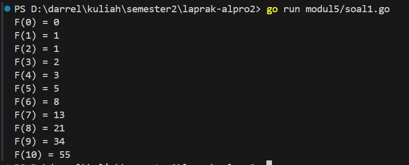
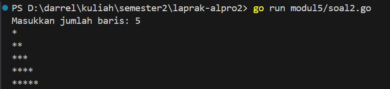
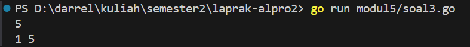
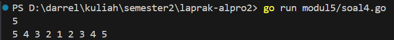
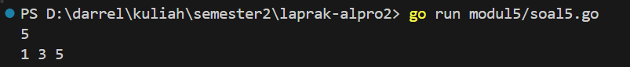
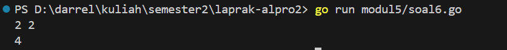

<h1 align="center">Laporan Praktikum Modul 5 <br> REKURSIF </h1> 

___
<h4 align="center">Gien Darrel Adli - 103112430008 </h4>

### Unguided

### Soal-1. 
Deret fibonacci adalah sebuah deret dengan nilai suku ke-0 dan ke-1 adalah 0 dan 1, dan nilai
suku ke-n selanjutnya adalah hasil penjumlahan dua suku sebelumnya. Secara umum dapat
diformulasikan 𝑆𝑛 = 𝑆𝑛−1 + 𝑆𝑛−2 . Berikut ini adalah contoh nilai deret fibonacci hingga suku
ke-10. Buatlah program yang mengimplementasikan fungsi rekursif pada deret fibonacci
tersebut.
𝑛 0 1 2 3 4 5 6 7 8 9 10
𝑆𝑛 0 1 1 2 3 5 8 13 21 34 55
```go
package main

import "fmt"

func fibonacci(n int) int {

    if n == 0 {
        return 0
    } else if n == 1 {
        return 1
    } else {
        return fibonacci(n-1) + fibonacci(n-2)
    }
}  

func main() {

    for i := 0; i <= 10; i++ {
        fmt.Printf("F(%d) = %d\n", i, fibonacci(i))
    }
}
```


>Program ini menghitung bilangan Fibonacci menggunakan rekursi. Fungsi fibonacci(n int) int akan mengembalikan 0 jika n == 0 dan 1 jika n == 1, sementara untuk nilai lainnya, ia menjumlahkan hasil rekursif dari fibonacci(n-1) + fibonacci(n-2). Fungsi main() menjalankan perulangan dari 0 hingga 10, mencetak nilai Fibonacci untuk setiap indeks.

### Soal-2
Buatlah sebuah program yang digunakan untuk menampilkan pola bintang berikut ini dengan
menggunakan fungsi rekursif. N adalah masukan dari user.
```go
package main

import "fmt"

func cetakBintang(n int) {
	if n == 0 {
		return
	}
	fmt.Print("*")
	cetakBintang(n - 1)
}

func cetakPola(n, barisSaatIni int) {
	if barisSaatIni > n {
		return
	}
	cetakBintang(barisSaatIni)
	fmt.Println()
	cetakPola(n, barisSaatIni+1)
}

func main() {
	var n int
	fmt.Print("Masukkan jumlah baris: ")
	fmt.Scan(&n)
	cetakPola(n, 1)
}


```


>Program ini mencetak pola segitiga bintang menggunakan rekursi. Fungsi `cetakBintang(n int)` mencetak n bintang dalam satu baris dengan rekursi. Fungsi cetakPola(n, barisSaatIni int) mencetak pola bintang secara bertahap dari 1 hingga n baris. Fungsi main() meminta pengguna memasukkan jumlah baris, lalu memanggil cetakPola(n, 1) untuk mencetak pola tersebut.

### Soal-3
Buatlah program yang mengimplementasikan rekursif untuk menampilkan faktor bilangan dari
suatu N, atau bilangan yang apa saja yang habis membagi N.
Masukan terdiri dari sebuah bilangan bulat positif N.
Keluaran terdiri dari barisan bilangan yang menjadi faktor dari N (terurut dari 1 hingga N ya).
```go
package main

import "fmt"

func cetakFaktor(n, i int) {
	if i > n {
		return
	}
	if n%i == 0 {
		fmt.Print(i, " ")
	}
	cetakFaktor(n, i+1)
}

func main() {
	var n int
	fmt.Scan(&n)
	cetakFaktor(n, 1)
}

```


>Program ini digunakan untuk mencetak faktor dari suatu bilangan dengan pendekatan rekursif. Fungsi cetakFaktor memeriksa apakah suatu angka dapat membagi bilangan yang diberikan tanpa sisa. Jika iya, angka tersebut ditampilkan. Fungsi ini terus berjalan hingga mencapai bilangan itu sendiri. Pada bagian utama program, pengguna diminta memasukkan sebuah bilangan, lalu fungsi rekursif dipanggil untuk menampilkan faktor-faktornya mulai dari satu hingga bilangan tersebut.


### Soal-4
Buatlah program yang mengimplementasikan rekursif untuk menampilkan barisan bilangan
tertentu.
Masukan terdiri dari sebuah bilangan bulat positif N.
Keluaran terdiri dari barisan bilangan dari N hingga 1 dan kembali ke N.
```go
package main

import "fmt"

func turunNaik(n, i int) {
	fmt.Print(i, " ")
	if i == 1 {
		return
	}
	turunNaik(n, i-1)
	fmt.Print(i, " ")
}

func main() {
	var n int
	fmt.Scan(&n)
	turunNaik(n, n)
}


```


>Program ini mencetak pola angka yang menurun dari suatu bilangan hingga satu, lalu naik kembali ke bilangan semula menggunakan rekursi. Fungsi **turunNaik** pertama-tama mencetak angka yang sedang diproses, kemudian memanggil dirinya sendiri dengan nilai yang berkurang satu hingga mencapai satu. Setelah itu, saat rekursi kembali, angka yang sama dicetak lagi untuk membentuk pola naik. Pada bagian utama program, pengguna memasukkan sebuah bilangan, lalu fungsi rekursif dipanggil untuk mencetak pola tersebut.

### Soal-5
Buatlah program yang mengimplementasikan rekursif untuk menampilkan barisan bilangan ganjil.
Masukan terdiri dari sebuah bilangan bulat positif N.
Keluaran terdiri dari barisan bilangan ganjil dari 1 hingga N.
```go
package main

import "fmt"

func cetakGanjil(i, n int) {
	if i > n {
		return
	}
	fmt.Print(i, " ")
	cetakGanjil(i+2, n)
}

func main() {
	var n int
	fmt.Scan(&n)
	cetakGanjil(1, n)
}
```


>Program ini mencetak deretan bilangan ganjil dari satu hingga bilangan yang dimasukkan oleh pengguna menggunakan rekursi. Fungsi **cetakGanjil** memeriksa apakah nilai yang sedang diproses lebih besar dari bilangan yang diberikan. Jika belum, angka tersebut dicetak lalu fungsi dipanggil kembali dengan menaikkan nilai sebanyak dua agar tetap dalam bilangan ganjil. Pada bagian utama program, pengguna memasukkan bilangan, lalu fungsi rekursif dijalankan mulai dari satu.

### Soal-6
Buatlah program yang mengimplementasikan rekursif untuk mencari hasil pangkat dari dua
buah bilangan.
Masukan terdiri dari bilangan bulat x dan y.
Keluaran terdiri dari hasil x dipangkatkan y.
Catatan: diperbolehkan menggunakan asterik "*", tapi dilarang menggunakan import "math".
```go
package main

import "fmt"

func pangkat(x, y int) int {
	if y == 0 {
		return 1
	}
	return x * pangkat(x, y-1)
}

func main() {
	var x, y int
	fmt.Scan(&x, &y)
	fmt.Println(pangkat(x, y))
}

```
![[modul5-6 1.png]]

>Program ini menghitung hasil perpangkatan dua bilangan menggunakan rekursi. Fungsi **pangkat** menerima dua bilangan, yaitu basis dan eksponen. Jika eksponen bernilai nol, fungsi mengembalikan satu karena setiap bilangan yang dipangkatkan nol hasilnya adalah satu. Jika tidak, bilangan dikalikan dengan hasil rekursi dari fungsi yang sama dengan eksponen dikurangi satu. Pada bagian utama program, pengguna memasukkan dua bilangan, lalu hasil perpangkatan ditampilkan.