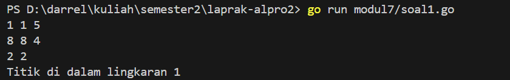
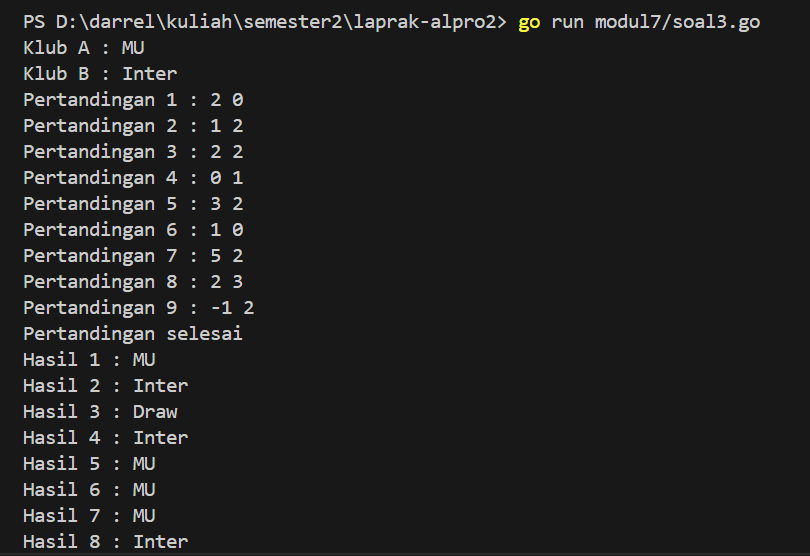
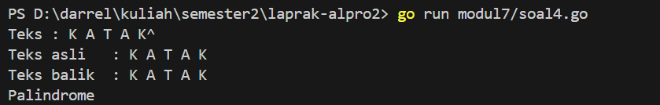

<h1 align="center">Laporan Praktikum Modul 7 <br> STRUCT dan ARRAY </h1> 

___
<h4 align="center">Gien Darrel Adli - 103112430008 </h4>

### Unguided

### Soal-1. 
Suatu lingkaran didefinisikan dengan koordinat titik pusat (𝑐𝑥, 𝑐𝑦) dengan radius 𝑟. Apabila
diberikan dua buah lingkaran, maka tentukan posisi sebuah titik sembarang (𝑥, 𝑦)
berdasarkan dua lingkaran tersebut. Gunakan tipe bentukan titik untuk menyimpan
koordinat, dan tipe bentukan lingkaran untuk menyimpan titik pusat lingkaran dan
radiusnya.
Masukan terdiri dari beberapa tiga baris. Baris pertama dan kedua adalah koordinat titik pusat
dan radius dari lingkaran 1 dan lingkaran 2, sedangkan baris ketiga adalah koordinat titik
sembarang. Asumsi sumbu x dan y dari semua titik dan juga radius direpresentasikan dengan
bilangan bulat.
Keluaran berupa string yang menyatakan posisi titik "Titik di dalam lingkaran 1 dan 2", "Titik
di dalam lingkaran 1", "Titik di dalam lingkaran 2", atau "Titik di luar lingkaran 1 dan 2".
```go
package main

import (
	"fmt"
	"math"
)

type Titik struct {
	x, y float64
}

type Lingkaran struct {
	titikPusat Titik
	radius     float64
}

func jarak(a, b Titik) float64 {
	return math.Sqrt(math.Pow(a.x-b.x, 2) + math.Pow(a.y-b.y, 2))
}

func diDalam(l Lingkaran, t Titik) bool {
	return jarak(l.titikPusat, t) <= l.radius
}

func main() {
	var lingkaran [2]Lingkaran
	var titik Titik

	fmt.Scan(&lingkaran[0].titikPusat.x, &lingkaran[0].titikPusat.y, &lingkaran[0].radius)

	fmt.Scan(&lingkaran[1].titikPusat.x, &lingkaran[1].titikPusat.y, &lingkaran[1].radius)

	fmt.Scan(&titik.x, &titik.y)

	dalam1 := diDalam(lingkaran[0], titik)
	dalam2 := diDalam(lingkaran[1], titik)

	if dalam1 && dalam2 {
		fmt.Println("Titik di dalam lingkaran 1 dan 2")
	} else if dalam1 {
		fmt.Println("Titik di dalam lingkaran 1")
	} else if dalam2 {
		fmt.Println("Titik di dalam lingkaran 2")
	} else {
		fmt.Println("Titik di luar lingkaran 1 dan 2")
	}
}

```


>Program ini digunakan untuk menentukan apakah sebuah titik berada di dalam satu atau dua lingkaran berdasarkan masukan koordinat pusat dan jari-jari masing-masing lingkaran. Program ini menggunakan dua struct, yaitu Titik untuk menyimpan koordinat x dan y, serta Lingkaran yang menyimpan titik pusat dan radius. Fungsi jarak digunakan untuk menghitung jarak antara dua titik dengan rumus Pythagoras, lalu fungsi diDalam memeriksa apakah jarak titik ke pusat lingkaran kurang dari atau sama dengan radius, yang berarti titik tersebut berada di dalam lingkaran. Di dalam fungsi main, program membaca input data dua buah lingkaran (pusat dan radius) serta satu titik yang akan diperiksa. Kemudian, dilakukan pengecekan apakah titik tersebut berada di dalam lingkaran pertama, kedua, keduanya, atau tidak di dalam keduanya. Hasilnya kemudian ditampilkan dalam bentuk keterangan yang sesuai.

### Soal-2
Sebuah array digunakan untuk menampung sekumpulan bilangan bulat. Buatlah program
yang digunakan untuk mengisi array tersebut sebanyak N elemen nilai. Asumsikan array
memiliki kapasitas penyimpanan data sejumlah elemen tertentu. Program dapat
menampilkan beberapa informasi berikut:
a. Menampilkan keseluruhan isi dari array.
b. Menampilkan elemen-elemen array dengan indeks ganjil saja.
c. Menampilkan elemen-elemen array dengan indeks genap saja (asumsi indek ke-0 adalah
genap).
d. Menampilkan elemen-elemen array dengan indeks kelipatan bilangan x. x bisa diperoleh
dari masukan pengguna.
e. Menghapus elemen array pada indeks tertentu, asumsi indeks yang hapus selalu valid.
Tampilkan keseluruhan isi dari arraynya, pastikan data yang dihapus tidak tampil
f. Menampilkan rata-rata dari bilangan yang ada di dalam array.
g. Menampilkan standar deviasi atau simpangan baku dari bilangan yang ada di dalam array
tersebut.
h. Menampilkan frekuensi dari suatu bilangan tertentu di dalam array yang telah diisi
tersebut.
```go
package main

import (
    "fmt"
    "math"
)

func rataRata(arr []int) float64 {
    var sum int
    for _, v := range arr {
        sum += v
    }
    return float64(sum) / 10
}

func standarDeviasi(arr []int) float64 {
    mean := rataRata(arr)
    var sumSquareDif float64
    for _, v := range arr {
        sumSquareDif += math.Pow(float64(v)-mean, 2)
    }
    return math.Sqrt(sumSquareDif / float64(len(arr)))
}

func frekuensi(arr []int, target int) int {
    count := 0
    for _, v := range arr {
        if v == target {
            count++
        }
    }
    return count
}

func tampilkanIndeksGanjil(arr []int) {
    fmt.Println("\nElemen dengan indeks ganjil:")
    for i := 0; i < len(arr); i += 2 {
        fmt.Print(arr[i])
    }
    fmt.Println("")
}

func tampilkanIndeksGenap(arr []int) {
    fmt.Println("\nElemen dengan indeks genap:")
    for i := 1; i < len(arr); i += 2 {
        fmt.Print(arr[i])
    }
    fmt.Println(" ")
}

func tampilkanIndeksKelipatanX(arr []int, x int) {
    fmt.Printf("\nElemen dengan indeks kelipatan %d:\n", x)
    for i := 0; i < len(arr); i++ {
        if i%x == 0 {
            fmt.Print(arr[i])
        }
    }
    fmt.Println("")
}

func hapusElemen(arr []int, index int) []int {
    return append(arr[:index], arr[index+1:]...)
}

func main() {
    var x, target, indexToDelete int

    arr := []int{1, 2, 3, 4, 5, 6, 7, 8, 9, 10}

    fmt.Print("\nMasukkan nilai untuk kelipatan x: ")
    fmt.Scan(&x)

    fmt.Print("\nMasukkan nomer yang ingin dihapus: ")
    fmt.Scan(&indexToDelete)

    fmt.Print("\nMasukkan bilangan yang ingin dihitung frekuensinya: ")
    fmt.Scan(&target)

    fmt.Println("\n--- OUTPUT ---")

    fmt.Println("\nIsi keseluruhan array:")
    fmt.Print(arr, "\n")

    tampilkanIndeksGanjil(arr)
    tampilkanIndeksGenap(arr)
    tampilkanIndeksKelipatanX(arr, x)

    arr = hapusElemen(arr, indexToDelete)
    fmt.Println("\nIsi array setelah elemen dihapus:")
    fmt.Print(arr, "\n")

    fmt.Printf("\nRata-rata: %.2f\n", rataRata(arr))
    fmt.Printf("Standar deviasi: %.2f\n", standarDeviasi(arr))

    freq := frekuensi(arr, target)
    fmt.Printf("Frekuensi bilangan %d: %d kali\n", target, freq)
}
```

>Program ini digunakan untuk melakukan beberapa operasi analisis pada array bilangan bulat. Pertama, program menerima input dari pengguna untuk menentukan nilai kelipatan indeks, indeks elemen yang ingin dihapus, dan bilangan yang ingin dihitung frekuensinya. Setelah itu, program menampilkan isi array secara keseluruhan, kemudian mencetak elemen pada indeks ganjil, indeks genap, dan indeks yang merupakan kelipatan dari nilai yang dimasukkan. Elemen pada indeks tertentu akan dihapus, dan isi array setelah penghapusan ditampilkan. Selanjutnya, program menghitung rata-rata dan standar deviasi dari nilai-nilai dalam array, serta menghitung frekuensi kemunculan bilangan tertentu. Semua hasil ditampilkan di konsol dengan penjelasan yang sesuai.

### Soal-3
Sebuah program digunakan untuk menyimpan dan menampilkan nama-nama klub yang
memenangkan pertandingan bola pada suatu grup pertandingan. Buatlah program yang
digunakan untuk merekap skor pertandingan bola 2 buah klub bola yang berlaga.
Pertama-tama program meminta masukan nama-nama klub yang bertanding, kemudian
program meminta masukan skor hasil pertandingan kedua klub tersebut. Yang disimpan
dalam array adalah nama-nama klub yang menang saja.
Proses input skor berhenti ketika skor salah satu atau kedua klub tidak valid (negatif). Di akhir
program, tampilkan daftar klub yang memenangkan pertandingan.
Perhatikan sesi interaksi pada contoh berikut ini (teks bergaris bawah adalah input/read)
```go
package main

import (
	"fmt"
)

type Klub struct {
	namaA string
	namaB string
}

type Pertandingan struct {
	skorA int
	skorB int
}

func main() {
	var klub Klub
	var hasil []string
	var skor Pertandingan
	var i int = 1

	fmt.Print("Klub A : ")
	fmt.Scan(&klub.namaA)

	fmt.Print("Klub B : ")
	fmt.Scan(&klub.namaB)

	for {
		fmt.Printf("Pertandingan %d : ", i)
		fmt.Scan(&skor.skorA, &skor.skorB)

		if skor.skorA < 0 || skor.skorB < 0 {
			fmt.Println("Pertandingan selesai")
			break
		}

		if skor.skorA > skor.skorB {
			hasil = append(hasil, klub.namaA)
		} else if skor.skorA < skor.skorB {
			hasil = append(hasil, klub.namaB)
		} else {
			hasil = append(hasil, "Draw")
		}
		i++
	}

	for j, h := range hasil {
		fmt.Printf("Hasil %d : %s\n", j+1, h)
	}
}

```


>Program ini digunakan untuk mencatat hasil beberapa pertandingan antara dua klub sepak bola. Pengguna pertama-tama memasukkan nama dua klub, yaitu Klub A dan Klub B. Kemudian program masuk ke dalam perulangan untuk menerima input skor dari pertandingan satu per satu. Jika skor yang dimasukkan bernilai negatif, maka dianggap sebagai tanda pertandingan selesai dan perulangan berhenti. Untuk setiap pertandingan, program membandingkan skor kedua klub dan mencatat pemenangnya, atau mencatat "Draw" jika hasilnya imbang. Setelah semua pertandingan dicatat, program menampilkan hasil dari setiap pertandingan sesuai urutan input.


### Soal-4
Sebuah array digunakan untuk menampung sekumpulan karakter, Anda diminta untuk
membuat sebuah subprogram untuk melakukan membalikkan urutan isi array dan memeriksa
apakah membentuk palindrom.
```go
package main

import (
	"fmt"
)

const NMAX = 127

type Teks struct {
	data [NMAX]rune
	n    int
}

func isiArray(t *Teks) {
	var input string
	fmt.Scanln(&input)

	t.n = 0
	for _, ch := range input {
		if ch == '^' {
			break
		}
		t.data[t.n] = ch
		t.n++
	}
}

func cetakArray(t Teks) {
	for i := 0; i < t.n; i++ {
		fmt.Printf("%c", t.data[i])
	}
	fmt.Println()
}

func balikArray(t Teks) Teks {
	var hasil Teks
	hasil.n = t.n
	for i := 0; i < t.n; i++ {
		hasil.data[i] = t.data[t.n-1-i]
	}
	return hasil
}

func palindrome(t1, t2 Teks) bool {
	for i := 0; i < t1.n; i++ {
		if t1.data[i] != t2.data[i] {
			return false
		}
	}
	return true
}

func main() {
	var teks Teks
	fmt.Print("Teks (akhiri dengan ^): ")
	isiArray(&teks)

	fmt.Print("Teks asli   : ")
	cetakArray(teks)

	terbalik := balikArray(teks)

	fmt.Print("Teks balik  : ")
	cetakArray(terbalik)

	if palindrome(teks, terbalik) {
		fmt.Println("Palindrome")
	} else {
		fmt.Println("Bukan Palindrome")
	}
}


```


>Program ini digunakan untuk mengecek apakah sebuah teks merupakan palindrome atau bukan. Pengguna diminta untuk memasukkan teks yang diakhiri dengan simbol ^. Teks tersebut akan disimpan dalam array bertipe rune, dan panjangnya dicatat dalam n. Setelah teks asli ditampilkan, program membalik urutan karakter dalam teks dan menyimpannya dalam array baru. Kedua array (teks asli dan teks terbalik) kemudian dibandingkan satu per satu. Jika semua karakter cocok di posisi yang berlawanan, maka teks tersebut adalah palindrome (teks yang sama saat dibaca dari depan maupun dari belakang). Jika tidak, maka teks tersebut bukan palindrome.

